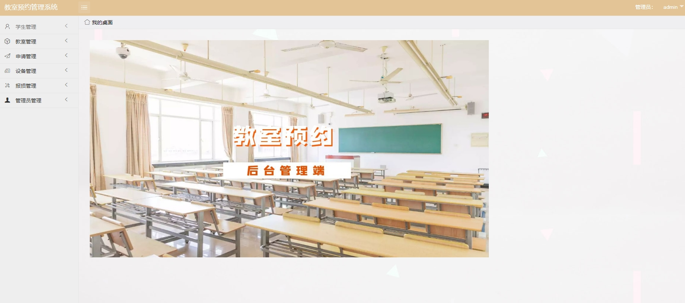
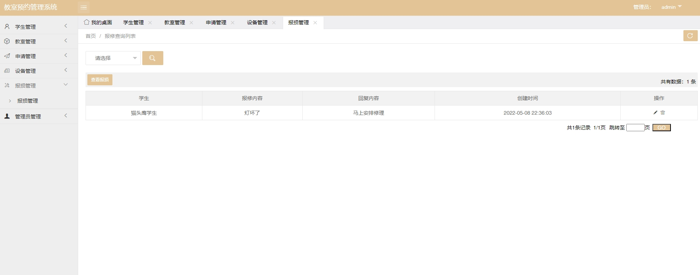

# 1.项目介绍
- 功能模块：管理员（学生管理、教师管理、申请管理、设备管理、报修管理等）、普通用户/学生（注册登录、申请预约、退订、报修等）
- 技术选型：SSM、JSP、uniapp等
- 测试环境：idea2024，mysql5.7，tomcat8，jdk1.8，Hbuilderx，微信开发工具，maven3
# 2.项目部署
## 2.1 后端部署
- 创建数据库，并导入sql文件
- 通过idea打开项目admin-yuyue，本根据本地数据库环境修改src/main/resources/mysql.properties  1-4行， 对于本地数据库是8.0及以上版本的，第1,2行修改特别重要
- 配置tomcat，其中deployment的配置如下图

- 启动tomca，后端管理web：http://localhost:8080/  管理员账号密码：admin、123
## 2.2 小程序部署
- 说明：不做修改的话，可以直接通过微信开发工具打开uni-yuyue\unpackage\dist\dev\mp-weixin，这是编译后的，配置小程序appid打开即可，如果你想做一些修改，请看下面的步骤
- 通过Hbuilderx打开项目uniapp-yuye
- 双击打开mainfest.json，基本配置里重新获取uniapp应用标识、微信小程序配置里可以配置你的小程序的appid或者小程序测试号的appid（自行申请）
- 运行 →运行小程序模拟器打开即可
- 正常会自动打开微信开发工具，信任运行即可（自己在Hbuilderx配置微信开发工具的路径）
# 项目部署截图

# 4.获取方式
[戳我查看](https://gitee.com/aven999/mall)
